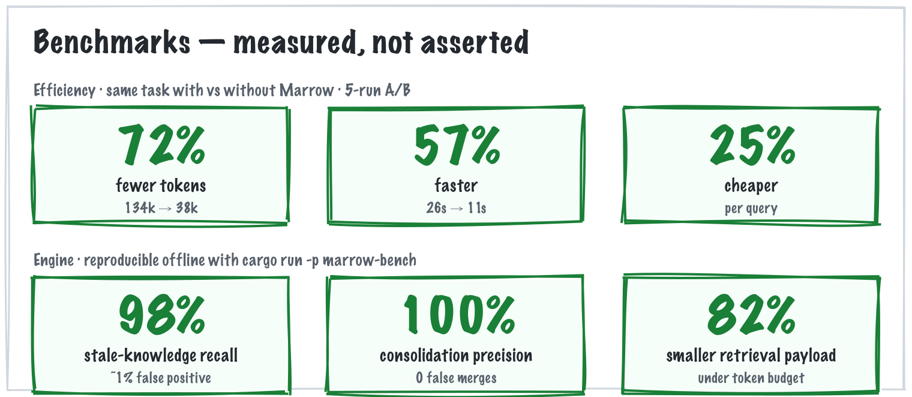

# Marrow 🦴

*Persistent, shared memory so your AI agents stop forgetting — and a hive mind so a swarm of them works as one.*

[](https://github.com/aryawidjaja/marrow/releases/latest)
[](https://github.com/aryawidjaja/marrow/actions)
[](LICENSE)
[](https://www.rust-lang.org)
[](https://modelcontextprotocol.io)
[](https://github.com/aryawidjaja/marrow/stargazers)

AI agents forget. Every session re-reads the codebase, repeats past decisions, and loses what it
learned when the context window compacts — and running several at once makes them collide. Marrow
fixes this. Memories are plain markdown files you can read and git-commit; a rebuildable SQLite
index adds query, hybrid keyword+vector search, provenance, and decay. Unlike a loose `CLAUDE.md`,
Marrow keeps memory **fresh** (it flags a note the moment the code it describes changes),
**coherent** (it merges duplicates and resolves contradictions on its own), and **shared** — a
**hive mind** where many agent sessions read and write one brain, sense what the others are doing,
and work as one swarm instead of colliding.

## Does it actually save tokens?


The same "understand this codebase" question, run through Claude Code against this repo — once with
Marrow, once without. The warm session recalls distilled memory instead of reading files. Plus the
engine benchmarks that reproduce offline:



| Metric | Cold (reads files) | Warm (Marrow) | Saved |
|---|---|---|---|
| Tokens | ~134k | ~38k | **~72%** |
| Time | ~26s | ~11s | **~57%** |
| Cost | ~$0.21 | ~$0.16 | ~25% |

The tell is the variance: **warm stays flat at ~38k tokens every run, while cold swings from 98k to
170k.** A warm session recalls a fixed, distilled briefing; a cold one re-reads the codebase — so the
gap *widens* on larger projects. Engine benchmarks (staleness ~1% false-positive at ~98% recall,
consolidation 100% clustering precision / 0 false merges, ~82% retrieval-budget token cut) reproduce
offline with `cargo run -p marrow-bench`. Method and caveats: [bench/REPORT.md](bench/REPORT.md).

## Install

Homebrew (macOS / Linux):
```bash
brew install aryawidjaja/marrow/marrow
```
Prebuilt binaries, no Rust:
```bash
curl -fsSL https://raw.githubusercontent.com/aryawidjaja/marrow/main/install.sh | sh
```
From source with Rust:
```bash
cargo install --git https://github.com/aryawidjaja/marrow marrow-cli marrow-mcp
```
Each puts `marrow` and `marrow-mcp` on your PATH (add `marrow-web` for the dashboard).

### Search: keyword by default, semantic is opt-in

Out of the box search is keyword (FTS5) — small, instant, fully offline. For **semantic** recall
(finds a "JWT" note when you search "login security"), install a build with an embedding model and
turn it on:
```bash
# Homebrew, semantic build (multilingual incl. Arabic; downloads a small model on first query):
brew install aryawidjaja/marrow/marrow-semantic
marrow embed fastembed

# …or via cargo:
cargo install --git https://github.com/aryawidjaja/marrow marrow-cli marrow-mcp --features embed-fastembed
marrow embed fastembed

# …or point at any OpenAI-compatible endpoint instead of a local model:
cargo install --git https://github.com/aryawidjaja/marrow marrow-cli marrow-mcp --features embed-http
marrow embed http --url https://your-endpoint/v1/embeddings
```
The brew/curl binaries are keyword-only — use a feature build above for semantic. `marrow status`
shows the active mode; `marrow embed none` reverts to keyword.

## Use it with your agent (Claude Code)

One command wires everything up — registers the MCP server for all your projects, installs the
auto-capture hooks, and adds a short guidance block:
```bash
cd your-project
marrow setup
```
Restart Claude Code. Now every session **starts warm** (it already knows what past sessions did and
decided), **claims files** so parallel sessions don't collide, and **captures durable decisions** —
automatically, no prompting. Each project keeps its own memory under `.marrow/`. Wiring every repo
at once? `marrow setup --global` installs the hooks user-wide instead of per-project.

**Adopting on an existing repo?** Its brain starts empty, so seed it from the docs you already have:
the first warm-start nudges the agent to run `marrow ingest`, which lists your READMEs/`docs/` and has
the agent distill them into memory. From then on, every session starts informed. And any time you
want to capture the session you're in, run **`/marrow-save`** — the agent writes what you decided to
the shared brain.

The agent gets the `mem_*` tools: `mem_write` / `mem_recall` / `mem_search` for memory, and
`mem_bootstrap` / `mem_claim` / `mem_activity` for the shared brain.

Just want the tools (no hooks), or using Cursor / Codex? Register the MCP server only:
```bash
claude mcp add marrow -s user -- marrow-mcp --root .          # Claude Code, every project
# or per-project: add the same server to .mcp.json / .cursor/mcp.json / Codex TOML
```
Other MCP agents get the full `mem_*` toolset and the `save` prompt, but the automatic hooks
(warm-start, collision-guard, activity) are Claude Code-specific — there, capture is a tool the
agent calls rather than a background reflex.

> **One brain across projects, or a team?** Point sessions at a shared store
> (`--root ~/marrow-shared` instead of `.`) — memories are scoped per project, so an agent can
> recall across them when it wants to. That shared/team brain is the direction the served and
> enterprise editions build on.

## What it does

- **Staleness detection** — a memory can cite a code symbol; Marrow fingerprints it and flags the
  note the moment the symbol's behavior or signature changes, while ignoring reformatting and
  renames. If the symbol just moved, it relocates the citation instead of crying stale.
- **Consolidation** — clusters related memories by meaning, merges duplicates, resolves
  contradictions, and retires expired notes, preserving lineage.
- **Hive mind** — many agent sessions work as one swarm over one shared brain: each joins *warm*
  (`bootstrap` — it already knows what others did), `claim`s its work so two never collide, and reads
  a live activity trail each turn — the swarm's pheromone trail — so every agent senses what the
  others are doing. Unlike a black-box hive, it's fully **auditable**: every signal is in the ledger.
  Vendor-neutral over MCP.
- **Audit & provenance** — every write, supersede, and recall lands in an append-only, hash-chained
  ledger; `marrow audit` proves it untampered, and any answer traces back to its sources.
- **Typed & validated** — five schemas (`fact`, `decision`, `entity`, `session`, `skill`); bad
  writes are rejected with reasons; lifecycle via supersede, confidence, and decay.
- **Runs anywhere** — a single offline binary; nothing leaves your machine.

## CLI

```bash
marrow add --kind decision --topic auth "We use short-lived JWTs."
marrow search "token expiry" --weight 1   # 0 = keyword, 1 = semantic
marrow list-stale --repo .                # notes whose code drifted
marrow consolidate --repo . --apply       # merge duplicates, retire expired
marrow audit                              # verify the ledger
marrow-serve --root . --port 8088         # local dashboard
```

That `marrow add` doesn't write to an opaque database — it saves a plain markdown file under
`.marrow/memory/` that you (and git) can read and edit by hand. The YAML frontmatter is the
metadata; the text below it is the memory:

```markdown
---
type: decision
topic: auth
confidence: 1.0
---
We use short-lived JWTs for sessions.
```

(That's `.marrow/memory/decision/<id>.md` — the SQLite index is just a rebuildable cache over
these files.)

## How it works

- **Markdown is the source of truth.** The SQLite index under `.marrow/.index` is a disposable
  cache — `marrow doctor` rebuilds it from the files. Writes are atomic (temp file + rename).
- **Search** is keyword (FTS5) by default; semantic (vector embeddings, fused with keyword via
  reciprocal rank fusion, tuned by `--weight`) is an opt-in — see [Install](#search-keyword-by-default-semantic-is-opt-in).
- **Staleness** records a structural fingerprint of the cited symbol plus a normalized copy for
  relocation; a note is stale only when the code is genuinely gone or changed. Rust today, via
  tree-sitter; other languages by adding grammars.
- **Consolidation** judges each cluster with a pluggable distiller (merge / resolve / keep) —
  deterministic by default, or pointed at a local or sovereign-hosted LLM, so nothing leaves your
  infrastructure.
- **It's a library.** `marrow-store` is a normal Rust crate; the CLI, MCP server, and dashboard are
  thin layers over it.

## Anthropic memory-tool backend

`python/marrow-anthropic` implements Anthropic's memory tool (`memory_20250818`) with strict path
confinement — see its [README](python/marrow-anthropic/README.md).

## The name

Marrow is the essential core a body grows from — and, biologically, where the immune system's
memory begins: the quiet, foundational layer an agent's knowledge is built on and remembered from.

## License

Dual-licensed: the engine (`crates/`) is **AGPL-3.0-only**; the embeddable Python backend
(`python/marrow-anthropic`) is **Apache-2.0**. Using Marrow from your agent over MCP or the CLI is a
separate process, not a derivative work. A commercial license is available — see
[COMMERCIAL.md](COMMERCIAL.md).
