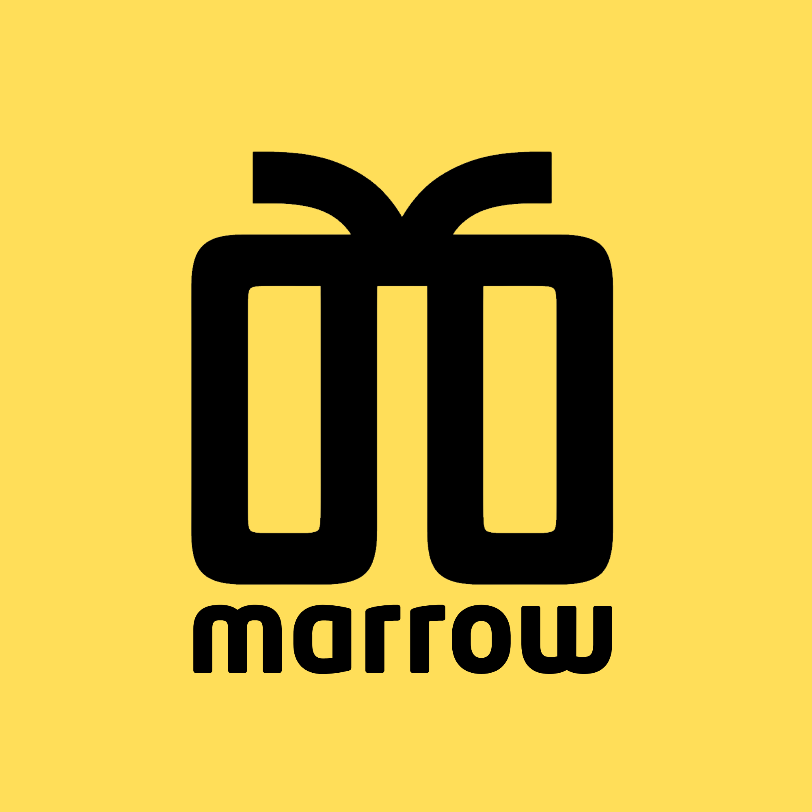

<p align="center"></p>

<h1 align="center">marrow</h1>

*Shared memory and a coordination layer for your AI coding agents.*

[](https://github.com/aryawidjaja/marrow/releases/latest)
[](LICENSE)
[](https://www.rust-lang.org)
[](https://github.com/aryawidjaja/marrow/stargazers)

[](https://modelcontextprotocol.io)
[](https://www.anthropic.com/claude-code)
[](https://cursor.com)
[](https://openai.com/codex)

## Agents are smart. Starting over is not.

Long projects rarely fit in one context window. A session ends, the next agent has to rediscover the
same decisions, and parallel agents work without knowing what the others are doing.

Marrow gives them a shared place to remember and coordinate. It keeps the useful parts of the work —
decisions, facts, gotchas, and progress — instead of trying to preserve every line of every chat.

- A new session can pick up where the last one stopped.
- Agents can talk in shared rooms and hand work to each other.
- Live activity and best-effort file claims help parallel agents avoid conflicting edits.
- Knowledge can be shared across projects and, when you choose, across devices.
- Everything stays in plain files you can read, edit, move, and own.

Marrow is built for work that takes more than one agent, one session, or one machine.

## The Pluribus idea

In *Pluribus*, Carol stays herself while Zosia connects her to a collective that can organize around
what she needs. She does not disappear into the hive; the hive works for her.

That is the feeling behind Marrow. Each agent stays its own session and keeps doing what it does best,
but they share what matters and coordinate around the same work. You stay in control, and the memory
stays in plain files on your machine.

## Get started in 3 steps

**1. Install** (macOS / Linux; other options below):
```bash
brew install aryawidjaja/marrow/marrow
```

**2. Set it up** from your project's root:
```bash
marrow setup          # add --global to wire every repo at once
```

**3. Check setup, then restart your agent.** `marrow setup` reports anything still missing. Claude
Code sessions then start with relevant project memory, share activity, and use best-effort file claims
to avoid local edit conflicts. The hooks need `jq` (`brew install jq` or `apt install jq`) and never
block your work when Marrow is unavailable. Already mid-session? Run **`/marrow-save`** once to keep
the decisions and discoveries worth carrying forward.

The memory lives in `.marrow/` in your project.

## See your brain

Marrow isn't a black box, it's a graph you can explore, like a second brain.

```bash
marrow-serve          # opens the dashboard at http://localhost:8088
```

Every memory is a neuron, grouped into the area it belongs to, so the graph has real structure
instead of being a hairball. Links connect memories that share a topic, a tag, or **related meaning**
(from embeddings). Browse the tree, drag, zoom, click to read, filter, and **add, edit, or delete**
memories right there. The **Hive** tab shows every project at once.

## Your memories are organised, not a pile

Every memory lives in an **area** of the project: `auth`, `billing`, `infra`. The agent files it as it
writes, so the brain has a shape you can navigate instead of one flat heap.

```
project  →  area  →  topic  →  versions
```

```bash
marrow areas          # the map: auth 11 · billing 10 · infra 23 · monitoring 10
```

Your agent sees that same map the moment a session starts, so it knows what the project knows before
it answers. It can also weight a recall toward one area without hiding the rest:

```bash
marrow add --kind decision --topic jwt-expiry --area auth "We use 15-minute JWTs."
```

Nothing is forced. If a memory fits no area, it stays unfiled and is still fully searchable. A wrong
area is worse than none.

## One brain across your projects

By default each project has its own brain. Opt any project into a machine-wide **hive** with one
command, and your agents can recall across all of them:

```bash
cd ~/code/webapp && marrow hub register --name webapp
cd ~/code/api    && marrow hub register --name api

marrow hub recall "how do we do auth"   # searches every project, tagged by project
```

Now an agent working in `api` can ask what `webapp` knows. In the dashboard, the **Hive** tab shows a
central *core* neuron (you) with every project orbiting it, bridged where they share ideas.

## Give your agents a room to talk

Once a project joins the hive, its agents can open named rooms, ask each other questions, reply, and
hand work over without relying on one giant chat. Claude Code, Codex, Cursor, and other MCP agents on
the same machine can use the same channel.

Agents check the inbox when they start and before touching work another session may own. You can read
every room in the dashboard's **Channel** tab, so the coordination stays visible instead of happening
behind your back.

## One brain across your devices (beta)

Each project is local and private by default. Share the *one* project you want synced, and the rest
stay on your machine. It's like sharing a repo, not your whole disk.

```bash
# once, on a server (Docker, Fly.io, any host; see deploy/)
MARROW_TOKEN=$(openssl rand -hex 16) marrow-server

# then in the project you want shared, on each machine
MARROW_TOKEN=<the-token> marrow share --gateway https://your-gateway --space team-app
```

Same gateway + space + token on two machines routes their MCP memory tools to one remote project
store. A decision saved through an agent on your laptop is available to an agent on your desktop.
Every other project is untouched. The backbone currently uses one bearer token; run it on
infrastructure you control over HTTPS and back up its data volume.

```bash
marrow status     # shows whether this project is shared or local
marrow unshare    # back to local, nothing is deleted
```

Your agent is told which mode it is working in. You can configure sharing from the dashboard's
**Manage Projects** panel. The local dashboard still visualizes the local project store;
shared-memory reads and writes happen through the agent's MCP tools. Full scope and deployment
guidance are in [deploy/README.md](deploy/README.md). Code anchors and freshness checks need the
source tree, so they remain local-only.

## More install options

Prebuilt binaries, no Rust:
```bash
curl -fsSL https://raw.githubusercontent.com/aryawidjaja/marrow/main/install.sh | sh
```
From source:
```bash
cargo install --git https://github.com/aryawidjaja/marrow marrow-cli marrow-mcp marrow-web marrow-server
```
This puts `marrow`, `marrow-mcp`, `marrow-serve`, and the cross-device `marrow-server` on your PATH.

## Bringing in an existing project

A fresh brain starts empty. To seed it from docs you already have, the first warm start nudges your
agent to run `marrow ingest`, it lists your README and `docs/` and distills them into memory. After
that, later sessions can start with those memories available. Any time, run **`/marrow-save`** to
preserve the decisions and discoveries worth carrying forward.

## Using Cursor, Codex, or other MCP agents

The automatic hooks are Claude Code specific, but any MCP agent gets the full memory toolset. Register
the server for every Claude Code project:
```bash
claude mcp add marrow -s user -- marrow-mcp --root .
```
For one project, add the same server to `.mcp.json` (Claude Code), `.cursor/mcp.json` (Cursor), or your
Codex TOML.

## Smarter (semantic) search

Search is keyword-based by default, instant and offline. For **meaning-based** recall (finding a note
about "JWT" when you search "login security"), install a semantic build:
```bash
brew install aryawidjaja/marrow/marrow-semantic   # multilingual, downloads a small model on first use
marrow embed fastembed
```
`marrow status` shows the mode; `marrow embed none` switches back. Semantic search also powers the
"related meaning" links in the dashboard graph.

## CLI

Your agent drives Marrow for you, but you can too:
```bash
marrow add --kind decision --topic auth "We use short-lived JWTs."   # save
marrow search "token expiry" --weight 1                              # find (0=keyword, 1=semantic)
marrow hub recall "rate limiting"                                    # search the whole hive
marrow list-stale --repo .                                           # notes whose code drifted
marrow consolidate --repo . --apply                                  # merge duplicates
marrow audit                                                         # prove the ledger untampered
```

`marrow add` writes a plain markdown file under `.marrow/memory/`, the YAML frontmatter is metadata,
the text below is the memory. The SQLite index is a rebuildable cache over these files.

## It doesn't forget the old stuff

The obvious worry with a memory that only ever grows: does the good idea from four months ago just
sink? Two things stop it.

**Recall follows the links.** Ask a question and Marrow doesn't only return what matched your words.
It takes the matches and spreads outward through the graph, a few links at a time, weakening with
each step. So a note that shares none of your vocabulary still surfaces if it sits behind one that
does. That old decision stays reachable through its neighbours, which is exactly what the links are
for.

**And the brain strengthens what it uses.** Every recall is recorded. A memory the agents keep
reaching for gets easier to reach again; one nobody has ever touched stays where it is. Recall a
thing enough and it comes to you.

When a decision changes, the agent supersedes the old memory instead of appending another active
version. Marrow preserves the lineage so the current answer stays clear without losing history.

## What's under the hood

- **Staleness detection for Rust**: a memory can cite a Rust symbol; Marrow fingerprints it and flags
  the note when that symbol changes, while tolerating formatting changes and supported relocations.
- **Consolidation**: finds genuine duplicates (a near-identical restatement, or a pair that are
  mutually each other's closest match) and merges them, preserving lineage. It will not merge notes
  that are merely similar.
- **Associative recall**: a question returns the matches *and* the memories connected to them, found
  by following links, shared topics and related meaning outward from the hits.
- **Hive mind**: sessions join warm, publish best-effort file claims, and read a live activity trail.
  Claude Code hooks can block a detected local collision, but deliberately fail open rather than
  risk blocking work when their prerequisites are unavailable.
- **Audit & provenance**: every write, edit, and recall lands in an append-only, hash-chained ledger;
  any answer traces back to its sources. Turn signing on and `marrow audit` also catches a memory
  file edited on disk behind Marrow's back.
- **Typed & validated**: every memory is a `fact` or a `decision` (or an `entity`), filed in an area
  under a short topic; bad writes are rejected with the reason, so the brain can't fill up with junk.
- **Expiry & confidence**: a memory can say how sure it is, and can carry an expiry date for things
  that are only true for now. Marrow retires them when they lapse.
- **Runs anywhere**: offline single binaries; markdown is the source of truth, SQLite a disposable cache.

## The name

Marrow is where the immune system's memory begins: the quiet layer that remembers while the rest of
the body keeps changing. Your agents share one too, but it stays yours, on your machine and on your
terms.

## License

The engine (`crates/`) is **AGPL-3.0-only**; the embeddable Python backend (`python/marrow-anthropic`)
is **Apache-2.0**. Using Marrow from your agent over MCP or the CLI is a separate process, not a
derivative work. A commercial license is available, see [COMMERCIAL.md](COMMERCIAL.md).
