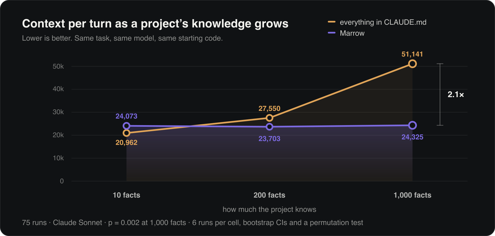

<p align="center"></p>

<h1 align="center">marrow</h1>

*Memory that keeps working after Claude's runs out — shared across your projects, machines and tools.*

[](https://github.com/aryawidjaja/marrow/releases/latest)
[](LICENSE)
[](https://www.marrow.works/)
[](https://www.rust-lang.org)
[](https://github.com/aryawidjaja/marrow/stargazers)

[](https://modelcontextprotocol.io)
[](https://www.anthropic.com/claude-code)
[](https://cursor.com)
[](https://openai.com/codex)

## Claude's memory stops at 25KB. This one doesn't.

Claude Code's built-in memory loads the first 200 lines of one file into every session. That is fine
for a young project. A codebase two years old knows more than fits in 200 lines, and everything past
the cut is simply dropped.

Marrow retrieves instead of loading. Ask a question and it returns the twenty memories that answer it,
plus the ones linked to those, out of however many thousand you have.

**At 1,000 project facts that is 2.1× less context per turn (p = 0.002) and $0.50 a task instead of
$0.90.** [Numbers and method below.](#does-it-actually-help-we-measured-it)

It also does three things the built-in memory does not:

- **One brain across projects.** Built-in memory is per repository. Marrow's hive lets an agent in
  `api` recall what `webapp` knows.
- **One brain across machines and teammates.** Built-in memory is explicitly machine-local. Marrow
  syncs through a relay you run, or [Spinal Cloud](https://spinal.cloud) if you would rather not.
- **One brain across tools.** Claude Code, Cursor and Codex read and write the same memory over MCP.

And because several agents share it, it also keeps them from colliding: a file another live session
is editing is claimed, and every agent's actions land in one append-only, hash-chained record you can
read.

Free forever, AGPL-3.0, runs on your machine. Every memory is a markdown file you can open and delete.

## Does it actually help? We measured it

<p align="center"></p>

The usual way to tell an agent how your project works is to write it all into a `CLAUDE.md`, which it
then reads on every single turn. That is fine for ten things. A codebase a couple of years old knows
a thousand.

We gave a coding agent the same task and the same repo three ways: nothing, everything in a
`CLAUDE.md`, and the same facts in Marrow. 75 runs.

- **A `CLAUDE.md` costs more the more your project knows.** 21k tokens per turn at 10 facts, 51k at
  a thousand. Marrow stays flat: 24.1k, 23.7k, 24.3k. At a thousand facts that is **2.1× less
  context** (p = 0.002) and **$0.50 a task instead of $0.90**.
- **Below roughly a hundred facts, just write the file.** Marrow loses that one, 0.87×, and takes
  more turns. We would rather say so than pretend it wins everywhere.
- **An agent with no project memory broke things.** It invented a database table, reached for
  `uuid4` where ids are meant to be sortable, and wrote a naive timestamp. Both of the arms that had
  the knowledge got those right.

Method: same fixture repo and prompt each time, graded by running the code rather than reading it,
with bootstrap intervals and a permutation test over 6 runs per cell. There is more on the numbers at
[marrow.works](https://www.marrow.works/).

## What about Claude Code's built-in memory?

Fair question, and the honest answer is that for a small project you may not need this.

Claude Code ships auto memory: Claude writes notes to `~/.claude/projects/<project>/memory/`, and a
`MEMORY.md` index is loaded into every session. It is on by default and it costs nothing. Use it and
be happy until one of these starts to bite:

|  | Built-in auto memory | Marrow |
|---|---|---|
| How memories reach the model | First 200 lines / 25KB of one index file, every session | Ranked retrieval: the matches, plus what they link to |
| What happens when it outgrows that | Claude is told to delete entries | Nothing; retrieval just searches more |
| Scope | One repository | Every project on the machine |
| Across your machines | No — "files are not shared across machines" | Yes, via a relay you run or Spinal Cloud |
| Across tools | Claude Code only | Claude Code, Cursor, Codex, any MCP client |
| Shared with teammates | No | Yes |
| Record of what agents did | No | Append-only, hash-chained, auditable |
| Flags memory that code has outgrown | No | Yes, for anchored Rust symbols |

The rule of thumb: **under a hundred facts, one repo, one machine, one tool — use the built-in.**
Marrow starts paying for itself past that, and our own benchmark says so out loud
([we lose at 10 facts](#does-it-actually-help-we-measured-it)).

The two are not exclusive. Auto memory is Claude's private scratchpad; Marrow is the shared record.

## Get started

**Claude Code**, one command:
```
/plugin marketplace add aryawidjaja/marrow
/plugin install marrow@marrow
```
Then install the binaries it drives (`brew install aryawidjaja/marrow/marrow`, or
`irm marrow.works/install.ps1 | iex` on Windows) and restart.

**Everything else** — Cursor, Codex, Claude Desktop, or if you would rather not use a plugin:
```bash
brew install aryawidjaja/marrow/marrow    # macOS/Linux; Windows: irm marrow.works/install.ps1 | iex
marrow setup                              # add --global to wire every repo at once
```
`marrow setup` seeds your brain with what it can work out about the repo on its own, so the first
session is not empty, and reports anything still missing. Restart your agent afterwards. The hooks
need `jq` and never block your work when Marrow is unavailable. Already mid-session? Run
**`/marrow-save`** to keep what is worth carrying forward.

Changed your mind? `marrow uninstall` puts everything back and keeps your memories. More ways to
install, including the no-terminal Claude Desktop bundle, are [further down](#more-install-options).

The memory lives in `.marrow/` in your project.

## See your brain

Marrow isn't a black box, it's a graph you can explore, like a second brain.

```bash
marrow-serve          # opens the dashboard at http://localhost:8088
```

Every memory is a neuron, grouped into the area it belongs to, so the graph has real structure
instead of being a hairball. Links connect memories that share a topic, a tag, or **related meaning**
(from embeddings). Browse the tree, drag, zoom, click to read, filter, and **add, edit, or delete**
memories right there. The **Hive** tab shows every project at once.

## Your memories are organised, not a pile

Every memory lives in an **area** of the project: `auth`, `billing`, `infra`. The agent files it as it
writes, so the brain has a shape you can navigate instead of one flat heap.

```
project  →  area  →  topic  →  versions
```

```bash
marrow areas          # the map: auth 11 · billing 10 · infra 23 · monitoring 10
```

Your agent sees that same map the moment a session starts, so it knows what the project knows before
it answers. It can also weight a recall toward one area without hiding the rest:

```bash
marrow add --kind decision --topic jwt-expiry --area auth "We use 15-minute JWTs."
```

Nothing is forced. If a memory fits no area, it stays unfiled and is still fully searchable. A wrong
area is worse than none.

## One brain across your projects

By default each project has its own brain. Opt any project into a machine-wide **hive** with one
command, and your agents can recall across all of them:

```bash
cd ~/code/webapp && marrow hub register --name webapp
cd ~/code/api    && marrow hub register --name api

marrow hub recall "how do we do auth"   # searches every project, tagged by project
```

Now an agent working in `api` can ask what `webapp` knows. In the dashboard, the **Hive** tab shows a
central *core* neuron (you) with every project orbiting it, bridged where they share ideas.

## Give your agents a room to talk

Once a project joins the hive, its agents can open named rooms, ask each other questions, reply, and
hand work over without relying on one giant chat. Claude Code, Codex, Cursor, and other MCP agents on
the same machine can use the same channel.

Agents check the inbox when they start and before touching work another session may own. You can read
every room in the dashboard's **Channel** tab, so the coordination stays visible instead of happening
behind your back.

## One brain across your devices (beta)

Each project is local and private by default. Share the *one* project you want synced, and the rest
stay on your machine. It's like sharing a repo, not your whole disk.

```bash
# once, on a server (Docker, Fly.io, any host; see deploy/)
MARROW_TOKEN=$(openssl rand -hex 16) marrow-server

# then in the project you want shared, on each machine
MARROW_TOKEN=<the-token> marrow share --gateway https://your-gateway --space team-app
```

Same gateway + space + token on two machines routes their MCP memory tools to one remote project
store. A decision saved through an agent on your laptop is available to an agent on your desktop.
Every other project is untouched. The backbone currently uses one bearer token; run it on
infrastructure you control over HTTPS and back up its data volume.

```bash
marrow status     # shows whether this project is shared or local
marrow unshare    # back to local, nothing is deleted
```

Your agent is told which mode it is working in. You can configure sharing from the dashboard's
**Manage Projects** panel. The local dashboard still visualizes the local project store;
shared-memory reads and writes happen through the agent's MCP tools. Full scope and deployment
guidance are in [deploy/README.md](deploy/README.md). Code anchors and freshness checks need the
source tree, so they remain local-only.

## More install options

Prebuilt binaries, no Rust:
```bash
curl -fsSL marrow.works/install.sh | sh
```
From source:
```bash
cargo install --git https://github.com/aryawidjaja/marrow marrow-cli marrow-mcp marrow-web marrow-server
```
This puts `marrow`, `marrow-mcp`, `marrow-serve`, and the cross-device `marrow-server` on your PATH.

### Windows

```powershell
irm marrow.works/install.ps1 | iex
```

Or with [Scoop](https://scoop.sh):
```powershell
scoop install https://github.com/aryawidjaja/marrow/releases/latest/download/marrow.json
```

Either way you get `marrow`, `marrow-mcp`, `marrow-serve` and `marrow-server`, no admin rights, no
Rust, semantic search already built in.

**Just want it in Claude Desktop?** Download `marrow-mcp.mcpb` from
[Releases](https://github.com/aryawidjaja/marrow/releases/latest) and double-click. No terminal at
all: it asks which project to remember and that is the whole setup.

The hooks that warm-start sessions and stop two agents editing the same file are shell scripts, so
they need [Git for Windows](https://git-scm.com/download/win) and [jq](https://jqlang.github.io/jq/).
The installer says so if either is missing:
```powershell
winget install Git.Git jqlang.jq
```
Without them memory still works; the automatic coordination stays off. Prefer WSL2? Install the Linux
way inside it and everything behaves exactly as it does on Linux.

## Bringing in an existing project

A fresh brain starts empty. To seed it from docs you already have, the first warm start nudges your
agent to run `marrow ingest`, it lists your README and `docs/` and distills them into memory. After
that, later sessions can start with those memories available. Any time, run **`/marrow-save`** to
preserve the decisions and discoveries worth carrying forward.

## Using Cursor, Codex, or other MCP agents

The automatic hooks are Claude Code specific, but any MCP agent gets the full memory toolset. Register
the server for every Claude Code project:
```bash
claude mcp add marrow -s user -- marrow-mcp --root .
```
For one project, add the same server to `.mcp.json` (Claude Code), `.cursor/mcp.json` (Cursor), or your
Codex TOML.

## Semantic search

Builds that ship with the local embedding model (the `marrow-semantic` formula, and the Windows and
`install.sh` builds) use **meaning-based** recall by default, so a note about "JWT" is found by
searching "login security". The plain `marrow` formula is keyword-only and smaller:
```bash
brew install aryawidjaja/marrow/marrow-semantic   # multilingual, downloads a small model on first use
```
`marrow status` shows the mode; `marrow embed none` switches back, `marrow embed fastembed` switches on. Semantic search also powers the
"related meaning" links in the dashboard graph.

## CLI

Your agent drives Marrow for you, but you can too:
```bash
marrow add --kind decision --topic auth "We use short-lived JWTs."   # save
marrow search "token expiry" --weight 1                              # find (0=keyword, 1=semantic)
marrow hub recall "rate limiting"                                    # search the whole hive
marrow list-stale --repo .                                           # notes whose code drifted
marrow consolidate --repo . --apply                                  # merge duplicates
marrow audit                                                         # prove the ledger untampered
```

`marrow add` writes a plain markdown file under `.marrow/memory/`, the YAML frontmatter is metadata,
the text below is the memory. The SQLite index is a rebuildable cache over these files.

## It doesn't forget the old stuff

The obvious worry with a memory that only ever grows: does the good idea from four months ago just
sink? Two things stop it.

**Recall follows the links.** Ask a question and Marrow doesn't only return what matched your words.
It takes the matches and spreads outward through the graph, a few links at a time, weakening with
each step. So a note that shares none of your vocabulary still surfaces if it sits behind one that
does. That old decision stays reachable through its neighbours, which is exactly what the links are
for.

**And the brain strengthens what it uses.** Every recall is recorded. A memory the agents keep
reaching for gets easier to reach again; one nobody has ever touched stays where it is. Recall a
thing enough and it comes to you.

When a decision changes, the agent supersedes the old memory instead of appending another active
version. Marrow preserves the lineage so the current answer stays clear without losing history.

## What's under the hood

- **Staleness detection for Rust**: a memory can cite a Rust symbol; Marrow fingerprints it and flags
  the note when that symbol changes, while tolerating formatting changes and supported relocations.
- **Consolidation**: finds genuine duplicates (a near-identical restatement, or a pair that are
  mutually each other's closest match) and merges them, preserving lineage. It will not merge notes
  that are merely similar.
- **Associative recall**: a question returns the matches *and* the memories connected to them, found
  by following links, shared topics and related meaning outward from the hits.
- **Hive mind**: sessions join warm, publish best-effort file claims, and read a live activity trail.
  Claude Code hooks can block a detected local collision, but deliberately fail open rather than
  risk blocking work when their prerequisites are unavailable.
- **Audit & provenance**: every write, edit, and recall lands in an append-only, hash-chained ledger;
  any answer traces back to its sources. Turn signing on and `marrow audit` also catches a memory
  file edited on disk behind Marrow's back.
- **Typed & validated**: every memory is a `fact` or a `decision` (or an `entity`), filed in an area
  under a short topic; bad writes are rejected with the reason, so the brain can't fill up with junk.
- **Expiry & confidence**: a memory can say how sure it is, and can carry an expiry date for things
  that are only true for now. Marrow retires them when they lapse.
- **Runs anywhere**: offline single binaries; markdown is the source of truth, SQLite a disposable cache.

## The name

Marrow is where the immune system's memory begins: the quiet layer that remembers while the rest of
the body keeps changing. Your agents share one too, but it stays yours, on your machine and on your
terms.

## License

The engine (`crates/`) is **AGPL-3.0-only**; the embeddable Python backend (`python/marrow-anthropic`)
is **Apache-2.0**. Using Marrow from your agent over MCP or the CLI is a separate process, not a
derivative work. A commercial license is available, see [COMMERCIAL.md](COMMERCIAL.md).
